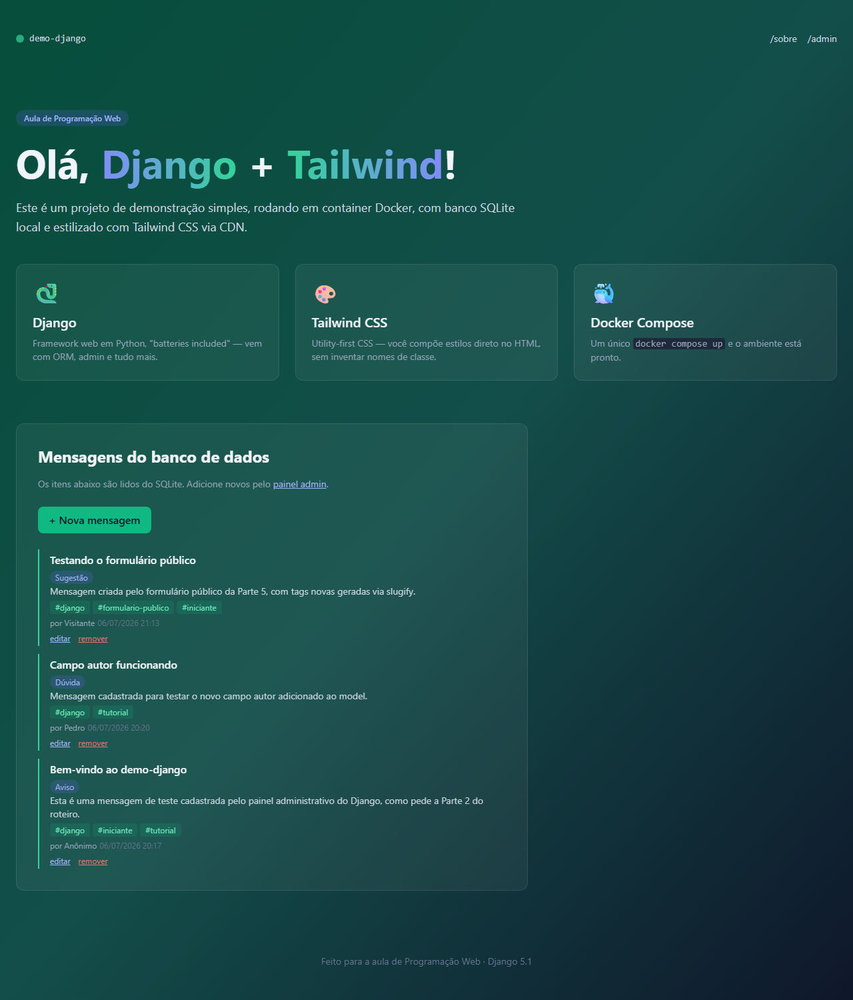
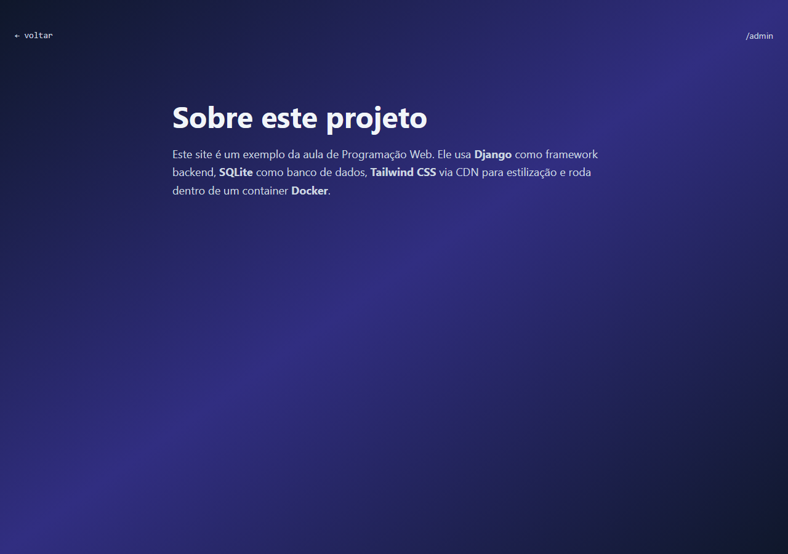
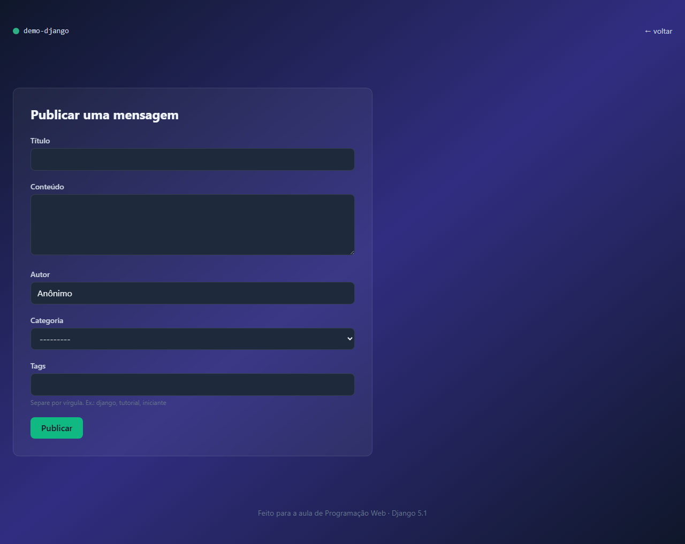
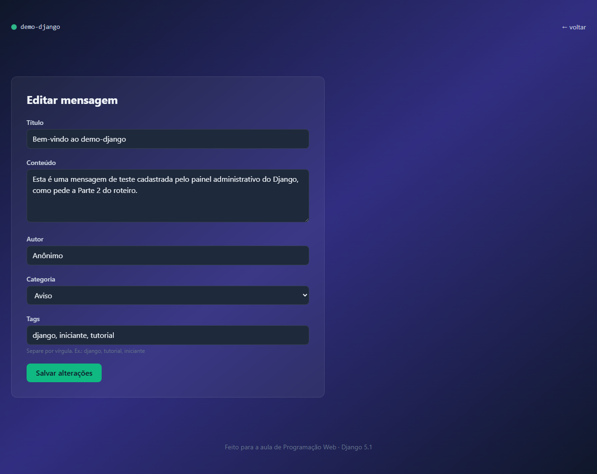
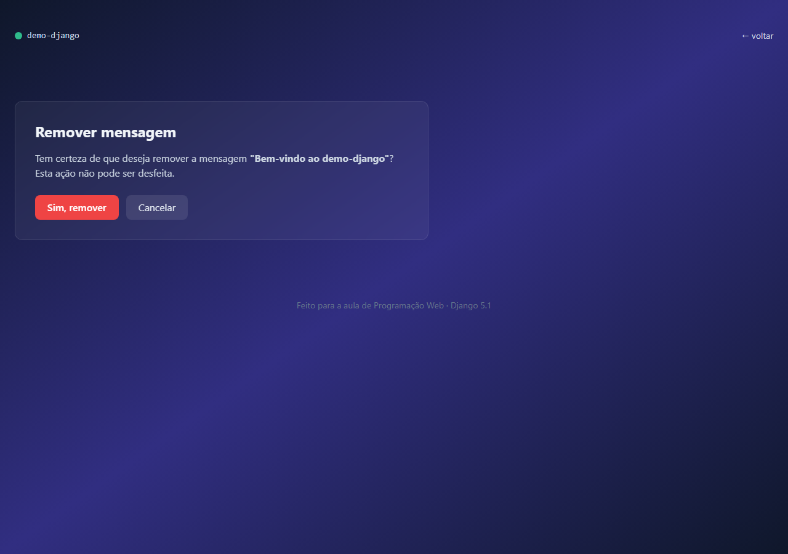

# demo-django

Site simples de uma página, escrito em **Django**, estilizado com **Tailwind CSS** (via CDN), salvando dados em **SQLite** e executado dentro de um container **Docker**.

Projeto construído seguindo o roteiro de [alinebrito/programacao-web](https://github.com/alinebrito/programacao-web), partes 1 a 6.



## Stack

- [Django](https://www.djangoproject.com/) 5.1
- [Tailwind CSS](https://tailwindcss.com/) via CDN (sem build)
- SQLite
- Docker + Docker Compose

## Como rodar

Pré-requisito: [Docker](https://docs.docker.com/get-docker/) (inclui o `docker compose`).

```bash
docker compose up --build
```

Isso constrói a imagem, aplica as migrations e sobe o servidor em **http://localhost:8000**.

Para parar:

```bash
docker compose down
```

Para criar um usuário administrador (acesso a **http://localhost:8000/admin/**):

```bash
docker compose exec web python manage.py createsuperuser
```

## Estrutura do projeto

```
demo-django/
├── core/                  # configuração do projeto Django
├── home/                  # app principal
│   ├── migrations/
│   ├── admin.py           # Mensagem, Categoria e Tag registrados no admin
│   ├── forms.py           # MensagemForm (ModelForm)
│   ├── models.py          # Mensagem, Categoria (1:N) e Tag (N:N)
│   ├── urls.py
│   └── views.py
├── templates/home/         # index, sobre, nova, editar, remover
├── Dockerfile
├── docker-compose.yml
└── requirements.txt
```

## Funcionalidades

O projeto evoluiu em seis etapas, cada uma versionada em seu próprio branch de entrega:

| Parte | Branch | O que foi feito |
|---|---|---|
| 1 | [`bcc481-django-parte1`](../../tree/bcc481-django-parte1) | Setup Docker + Django, model `Mensagem`, admin, view/template inicial |
| 2 | [`bcc481-django-parte2`](../../tree/bcc481-django-parte2) | Superusuário, campo `autor`, página `/sobre/`, ajuste visual |
| 3 | [`bcc481-django-parte3`](../../tree/bcc481-django-parte3) | Model `Categoria` (relacionamento 1:N via `ForeignKey`) |
| 4 | [`bcc481-django-parte4`](../../tree/bcc481-django-parte4) | Model `Tag` (relacionamento N:N via `ManyToManyField`) |
| 5 | [`bcc481-django-parte5`](../../tree/bcc481-django-parte5) | Formulário público para criar mensagens (Create do CRUD) |
| 6 | [`bcc481-django-parte6`](../../tree/bcc481-django-parte6) | Edição e remoção de mensagens (Update/Delete do CRUD) |

### Página inicial (`/`)

Lista as mensagens cadastradas, com categoria, tags, autor e data. Permite criar, editar e remover mensagens direto pela página.

### Sobre (`/sobre/`)



Página estática com informações sobre o projeto.

### Nova mensagem (`/nova/`)



Formulário público (`ModelForm`) para publicar uma mensagem com título, conteúdo, autor, categoria e tags (texto livre, separadas por vírgula — novas tags são criadas automaticamente via `slugify` + `get_or_create`).

### Editar mensagem (`/mensagens/<id>/editar/`)



Reaproveita o mesmo `MensagemForm`, pré-preenchido com os dados atuais da mensagem (inclusive as tags).

### Remover mensagem (`/mensagens/<id>/remover/`)



Página de confirmação — a remoção só acontece via **POST**, nunca via GET.

### Admin (`/admin/`)

Painel administrativo do Django com `Mensagem`, `Categoria` e `Tag` registrados, incluindo busca, filtros e seleção múltipla de tags (`filter_horizontal`).

## Modelo de dados

```
Categoria (1) ───< Mensagem (N) >─── Tag (N:N)
```

- **Mensagem**: título, conteúdo, autor, categoria (opcional), tags, data de criação.
- **Categoria**: nome único (ex.: Aviso, Dúvida, Sugestão).
- **Tag**: nome único em formato slug (ex.: `django`, `tutorial`).
